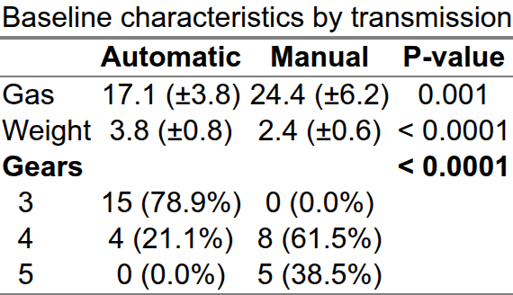

<!-- README.md is generated from README.Rmd. Please edit that file -->

```{r setup, include = FALSE}
knitr::opts_chunk$set(
  collapse = TRUE,
  comment = "#>",
  fig.path = "man/figures/README-",
  out.width = "100%",
  dpi = 150,
  message = FALSE,
  warning = FALSE
)
options(boxGrobTxtPadding = grid::unit(2, "mm"))
```

# Gmisc

<!-- badges: start -->
[](https://CRAN.R-project.org/package=Gmisc)
[](https://CRAN.R-project.org/package=Gmisc)
[](https://github.com/gforge/Gmisc/actions/workflows/ci.yaml)
<!-- badges: end -->

**Gmisc** collects utilities for the graphics and tables that recur in medical
research papers — built so they compose with the native R pipe (`|>`):

- **Descriptive "Table 1"** — `getDescriptionStatsBy()` + `htmlTable()` for
  publication-ready, copy-paste descriptive tables.
- **Grid-based flowcharts** — a `flowchart() |> spread() |> move() |> connect()`
  pipeline for CONSORT-style diagrams, including `phaseLabel()` headings.
- **Transition plots** — the `Transition` class for visualising how
  observations move between categories over time.
- **SVD variable selection** — `getSvdMostInfluential()` for picking influential
  variables.
- **Bézier arrows** — smooth arrows complementing the `grid` package.

## Installation

```r
# From CRAN
install.packages("Gmisc")

# Development version from GitHub
# install.packages("remotes")
remotes::install_github("gforge/Gmisc")
```

## Flowcharts & CONSORT diagrams

Build a flowchart as a named list of boxes, position the columns with
`spread()`/`move()`, then add the connectors. Parallel arms are just lists, and
`phaseLabel()` drops a CONSORT phase heading ("Allocation", "Follow-up", …)
between the arms — centred, slightly overlapping, and drawn on top.

```{r flowchart, fig.width = 8, fig.height = 7}
library(Gmisc)
library(grid)

main_gp <- gpar(fill = "white", col = "black", lwd = 1)
head_gp <- gpar(fill = "#c8daf7", col = "#2f5f9f", lwd = 1)
con_gp  <- gpar(col = "#4f86c6", fill = "#4f86c6", lwd = 1.8)
sw      <- unit(70, "mm")

flowchart(
  rando = boxGrob("Randomised\nN = 100", box_gp = main_gp),
  groups = list(
    boxGrob("Allocated to intervention\nn = 50", width = sw, box_gp = main_gp),
    boxGrob("Allocated to control\nn = 50", width = sw, box_gp = main_gp)
  ),
  followup = list(
    boxGrob("Lost to follow-up\nn = 1", width = sw, box_gp = main_gp),
    boxGrob("Lost to follow-up\nn = 2", width = sw, box_gp = main_gp)
  ),
  analysis = list(
    boxGrob("Analysed\nn = 49", width = sw, box_gp = main_gp),
    boxGrob("Analysed\nn = 48", width = sw, box_gp = main_gp)
  )
) |>
  spread(axis = "y", margin = unit(0.04, "npc")) |>
  move(subelement = list(c("groups", 1), c("followup", 1), c("analysis", 1)), x = 0.27) |>
  move(subelement = list(c("groups", 2), c("followup", 2), c("analysis", 2)), x = 0.73) |>
  phaseLabel("groups",   "Allocation", box_gp = head_gp) |>
  phaseLabel("followup", "Follow-up",  box_gp = head_gp) |>
  phaseLabel("analysis", "Analysis",   box_gp = head_gp) |>
  connect("rando",    "groups",   type = "N", lty_gp = con_gp, arrow_size = 3, smooth = TRUE) |>
  connect("groups",   "followup", type = "v", lty_gp = con_gp, arrow_size = 3) |>
  connect("followup", "analysis", type = "v", lty_gp = con_gp, arrow_size = 3)
```

See `vignette("Grid-based_flowcharts", package = "Gmisc")` for the full API.

## Descriptive "Table 1"

`getDescriptionStatsBy()` summarises variables split by a grouping column and
pipes straight into `htmlTable()` for a publication-ready table.

```{r table1-code, eval = FALSE}
library(dplyr)

mtcars |>
  mutate(am = factor(am, labels = c("Automatic", "Manual")),
         gear = factor(gear)) |>
  set_column_labels(mpg = "Gas", wt = "Weight", gear = "Gears") |>
  set_column_units(mpg = "Miles/gallon", wt = "10<sup>3</sup> lbs") |>
  getDescriptionStatsBy(mpg, wt, gear, by = am, statistics = TRUE) |>
  htmlTable(caption = "Baseline characteristics by transmission")
```

```{r table1-snapshot, include = FALSE}
library(dplyr)

tab <- mtcars |>
  mutate(am = factor(am, labels = c("Automatic", "Manual")),
         gear = factor(gear)) |>
  set_column_labels(mpg = "Gas", wt = "Weight", gear = "Gears") |>
  set_column_units(mpg = "Miles/gallon", wt = "10<sup>3</sup> lbs") |>
  getDescriptionStatsBy(mpg, wt, gear, by = am, statistics = TRUE) |>
  htmlTable(caption = "Baseline characteristics by transmission")

if (!dir.exists("man/figures")) dir.create("man/figures", recursive = TRUE)
table_html <- paste(capture.output(print(tab)), collapse = "\n")
html_file <- tempfile(fileext = ".html")
writeLines(
  paste0("<!DOCTYPE html><html><head><meta charset='utf-8'></head>",
         "<body style='display:inline-block; padding:12px; font-family:sans-serif'>",
         table_html, "</body></html>"),
  html_file
)
invisible(webshot2::webshot(html_file, "man/figures/README-table1.png", selector = "table", zoom = 2))
```

```{r table1-img, echo = FALSE, out.width = "85%"}

```

See `vignette("Descriptives", package = "Gmisc")` for the many formatting options.

## Transition plots

The `Transition` class shows how observations move between classes over time;
a third dimension can be encoded as a colour split within each box.

```{r transition, fig.width = 6, fig.height = 6, out.width = "70%"}
set.seed(1)
n <- 100
sex    <- sample(c("Male", "Female"), n, replace = TRUE)
before <- sample(1:3, n, replace = TRUE)
# Most cases improve one class, some stay, a few worsen
after  <- pmin(pmax(before - sample(c(-1, 0, 1), n, replace = TRUE, prob = c(.15, .35, .5)), 1), 3)

lbl <- c("A", "B", "C")
tbl <- table(factor(before, 1:3, lbl), factor(after, 1:3, lbl), sex)

transitions <- getRefClass("Transition")$new(tbl, label = c("Before surgery", "1 year after"))
transitions$title   <- "Charnley class before vs. after surgery"
transitions$clr_bar <- "bottom"
transitions$render()
```

See `vignette("Transition-class", package = "Gmisc")` for customisation.

## Learn more

- Project page: <https://gforge.se>
- Vignettes: `browseVignettes("Gmisc")`
- Bugs & feature requests: <https://github.com/gforge/Gmisc/issues>
